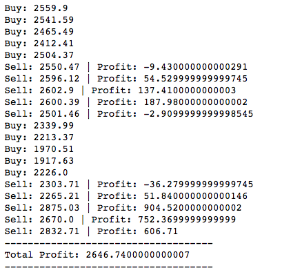

# Q-Learning on Bitcoin 
### By: Fabio Amendola, Teerapat (Mek) Jenrungrot, Yi Sheng Ong
Links: https://github.com/mjenrungrot/cryptobot-qlearn

## Introduction
Reinforcement learning is an area of machine learning concerened with how software agents should take actions in an environment to maximize the concept of rewards. With the recent achievements in deep neural network concept, people have successfully applied reinforcement learning with deep neural network to solve more complicated problems. In this project, we aim to study the application of reinforcement learning on the aspect of cryptocurrency investor, where the software agent is tasked to maximize the profit given that the agent can see historical prices.

## What is Deep Q Network (DQN)?

Reinforcement learning is a model that learns as interaction with the environment happens. Think a child learning how to walk by walking. It learns that certain ways of moving its legs are good in certain situations, to successfully walk. Q learning is a type of reinforcement learning that uses a specific loss function, Q(s, a) which takes in parameters current state s and potential action a. Q(s, a) is the predicted reward from doing such an action in the current state. We use a neural net to model Q, so that the input is a state and action and the output is the predicted reward.

Assume we've learned our function Q, we'd for the current state s, we'd want to choose action a to do such that Q(s, a) is maximized. The problem is that learning Q takes a ton of data depending on how complex we represent our state s and how many actions a we have.

## What we did.

We used Keras to implement a basic Q learning agent with 3 fully connected layers (64, 32, and 8 hidden units respectively). Then we trained the agent to maximize the profit on 10-year daily historical value of S&P 500 index (^GSPC). The trained model is then used to to evaluate on historical daily Bitcoin price on a separate, hold out dataset.

## Results.

We ran the model on 252 end of day bitcoin prices starting from January 01, 2017.

## Future work.

We could consider smaller time intervals for prices, like minute to minute or hour to hour. Smaller intervals might be useful because of how volatile bitcoin prices are.
