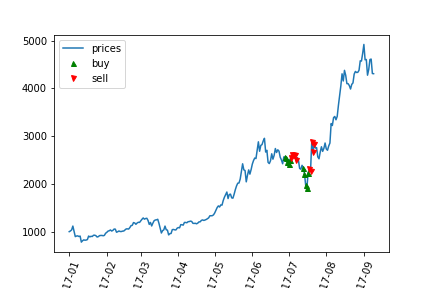

# Cryptobot-qlearn

## What is Deep Q Network (DQN)?

Reinforcement learning is a model that learns as interaction with the environment happens. Think a child learning how to walk by walking. It learns that certain ways of moving its legs are good in certain situations, to successfully walk. Q learning is a type of reinforcement learning that uses a specific loss function, Q(s, a) which takes in parameters current state s and potential action a. Q(s, a) is the predicted reward from doing such an action in the current state. We use a neural net to model Q, so that the input is a state and action and the output is the predicted reward.

Assume we've learned our function Q, we'd for the current state s, we'd want to choose action a to do such that Q(s, a) is maximized. The problem is that learning Q takes a ton of data depending on how complex we represent our state s and how many actions a we have.

## What we did.

We used Keras and an agent as a basic Q learner. Then we trained it on historical Bitcoin end of day price data and evaluated how well the Q learner did on a seperate, hold out dataset.

## Results.

We ran the model on 252 end of day bitcoin prices starting from January 01, 2017.

## Future work.

We could consider smaller time intervals for prices, like minute to minute or hour to hour. Smaller intervals might be useful because of how volatile bitcoin prices are.
